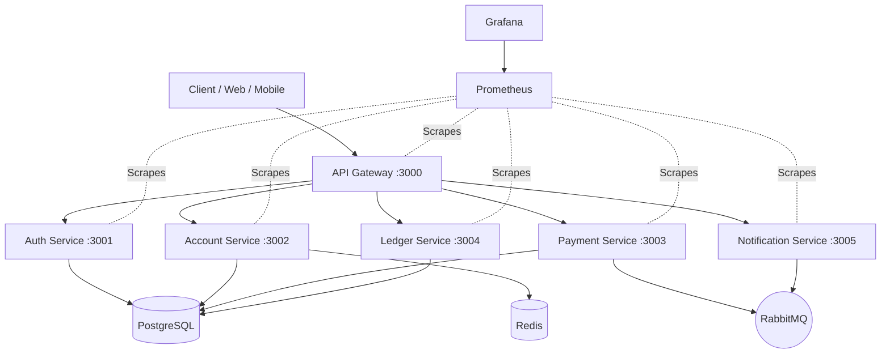

# VaultCore Architecture Overview

VaultCore is designed as an event-driven, production-ready microservices banking platform built for high availability, fault tolerance, and strict data consistency.

## Microservice Architecture & Responsibilities

| Service | Port | Database Schema | Primary Responsibility |
| :--- | :--- | :--- | :--- |
| **API Gateway** | 3000 | N/A | Reverse proxy, rate limiting, request routing, Swagger aggregation |
| **Auth Service** | 3001 | `auth` | User registration, authentication, JWT token lifecycle |
| **Account Service** | 3002 | `account` | Customer bank account lifecycle & real-time balances |
| **Payment Service** | 3003 | `payment` | Payment transfer processing, idempotency, event publishing |
| **Ledger Service** | 3004 | `ledger` | Double-entry financial bookkeeping & audit journal entries |
| **Notification Service** | 3005 | N/A | Asynchronous RabbitMQ consumer for email/SMS notifications |

## Core Principles

1. **Clean Architecture Layering**: Strict separation between Controllers, Services, Repositories, Routes, and Middleware.
2. **Double-Entry Accounting**: Ledger entries enforce `Total DEBIT == Total CREDIT`.
3. **Idempotency**: Payment requests require unique UUID idempotency keys stored in DB/Redis.
4. **Asynchronous Messaging**: RabbitMQ topic exchanges decoupling payment events from notifications.
