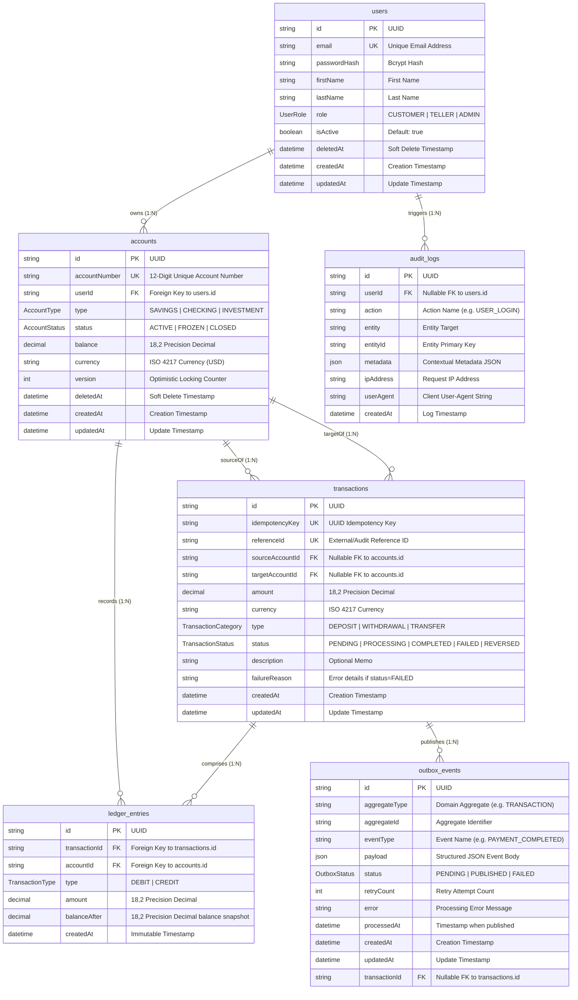

# VaultCore Production Database Specification

This document presents the refined relational database architecture for the VaultCore banking platform implemented using PostgreSQL 16 and Prisma ORM.

## Entity Relationship (ER) Diagram

---

## Key Refinements Summary

1. **High Precision Monetary Values (`Decimal(18, 2)`)**:
   - `accounts.balance`, `transactions.amount`, `ledger_entries.amount`, and `ledger_entries.balanceAfter` all use `@db.Decimal(18, 2)` to prevent overflow or truncation during large volume banking transactions.

2. **Unique Index Constraints**:
   - `accounts.accountNumber` features a `@unique` index and explicit `@@index([accountNumber])`.
   - `transactions.referenceId` features a `@unique` constraint and explicit `@@index([referenceId])`.

3. **Explicit `TransactionType` Enum for Ledger**:
   - `LedgerEntry.type` uses the `TransactionType` enum (`DEBIT` or `CREDIT`).
   - `Transaction.type` uses `TransactionCategory` (`DEPOSIT`, `WITHDRAWAL`, `TRANSFER`).

4. **Clean Transfer Metadata Isolation**:
   - `transactions` records money movement intent, routing, and status without mutating or storing account balance snapshots.

5. **Immutability & Locking Boundaries**:
   - `ledger_entries` remains strictly immutable (no `updatedAt` / `deletedAt`).
   - `accounts` maintains exclusive optimistic concurrency control via integer `version`.
