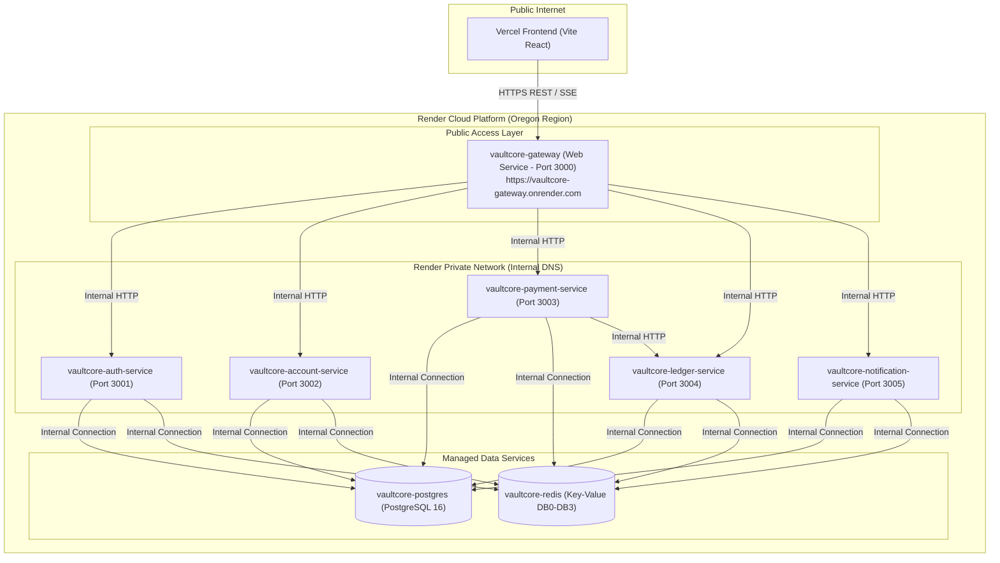

# VaultCore — Render Backend Deployment Guide

This guide provides step-by-step instructions to deploy the entire **VaultCore** backend microservices stack, PostgreSQL database, and Redis cache on **Render** using the provided Infrastructure-as-Code Blueprint (`render.yaml`).

---

## 1. Backend Architecture on Render

---

## 2. Step-by-Step Deployment via Render Blueprints

### Step 1: Log in to Render

1. Open [https://dashboard.render.com](https://dashboard.render.com).
2. Sign in with your **GitHub** account.

### Step 2: Create a New Blueprint Instance

1. In the Render Dashboard header, click **"New +"**.
2. Select **"Blueprint"** (Infrastructure as Code).
3. Connect your repository: **`H4rshitha/VaultCore`** (or search for `VaultCore`).
4. Select the **`main`** branch.

### Step 3: Review Blueprint Configuration

Render will automatically detect the [`render.yaml`](file:///c:/Users/HARSHITHA/OneDrive/Desktop/VaultCore/render.yaml) in your repository and display the resources to be created:

- **Database**: `vaultcore-postgres` (PostgreSQL)
- **Key-Value**: `vaultcore-redis` (Redis)
- **Web Service**: `vaultcore-gateway` (Public API endpoint)
- **Private Services**: `auth-service`, `account-service`, `payment-service`, `ledger-service`, `notification-service`

### Step 4: Click "Apply"

1. Click **"Apply"** or **"Create Blueprint"**.
2. Render will automatically:
   - Provision the PostgreSQL database.
   - Run the initial database migration via `preDeployCommand` (`npx prisma migrate deploy`).
   - Provision Redis.
   - Build all Docker images using their respective Dockerfiles.
   - Start all microservices in the private network and launch the Gateway.

---

## 3. Obtaining Your Live Backend URL

Once the `vaultcore-gateway` Web Service finishes building (indicated by a green checkmark):

1. Click on **`vaultcore-gateway`** in your Render Dashboard.
2. Copy the public URL at the top (e.g., `https://vaultcore-gateway.onrender.com`).
3. Verify gateway health in your browser:
   - `https://vaultcore-gateway.onrender.com/health` -> should return `{"status":"ok"}`
   - `https://vaultcore-gateway.onrender.com/health/ready` -> should return `{"status":"ok"}`

---

## 4. Connecting Your Vercel Frontend to Render Backend

Once you have your live Gateway URL, set the environment variables in your **Vercel** project:

| Vercel Variable Name | Value (Example)                                               |
| :------------------- | :------------------------------------------------------------ |
| `VITE_GATEWAY_URL`   | `https://vaultcore-gateway.onrender.com`                      |
| `VITE_API_BASE_URL`  | `https://vaultcore-gateway.onrender.com/api/v1`               |
| `VITE_SSE_URL`       | `https://vaultcore-gateway.onrender.com/api/v1/events/stream` |
| `VITE_APP_ENV`       | `production`                                                  |

---

## 5. Free-Tier / Zero-Cost Deployment Alternatives

If you prefer to stay 100% within Render's Free tier without paid private service add-ons:

1. You can deploy **`vaultcore-gateway`** as a Free Web Service.
2. For database & cache, use Render's Free PostgreSQL and Free Redis (or [Upstash Redis](https://upstash.com)).
3. Microservices can also be set up as individual Free Web Services on Render by setting their type to `web` in `render.yaml`.
