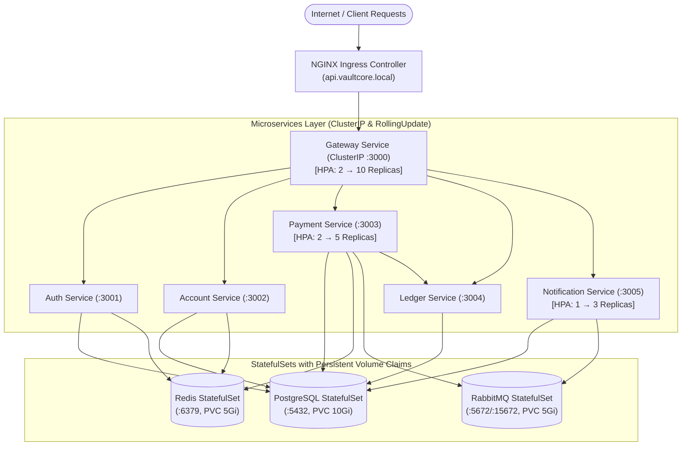

# Implementation Plan: VaultCore Prompt 15 — Kubernetes Deployment

Deploy the entire **VaultCore** distributed banking platform on **Kubernetes**, including all 6 microservices, StatefulSets for persistence infrastructure (PostgreSQL, Redis, RabbitMQ), PersistentVolumeClaims, ClusterIP networking, NGINX Ingress, Horizontal Pod Autoscalers (HPA), zero-downtime rolling updates, and health/liveness probes.

---

## 1. System Architecture in Kubernetes

---

## 2. Proposed Manifests & Configurations

### Configuration & Security
1. **`infrastructure/k8s/01-configmap.yaml`**:
   - `NODE_ENV: "production"`
   - Database connection parameters (`POSTGRES_HOST: "postgres-service"`, `POSTGRES_PORT: "5432"`, `POSTGRES_DB: "vaultcore_db"`)
   - Redis host/port (`REDIS_HOST: "redis-service"`, `REDIS_PORT: "6379"`)
   - RabbitMQ host/port (`RABBITMQ_HOST: "rabbitmq-service"`, `RABBITMQ_PORT: "5672"`)
   - Microservice target URLs (`AUTH_SERVICE_URL`, `ACCOUNT_SERVICE_URL`, `PAYMENT_SERVICE_URL`, `LEDGER_SERVICE_URL`, `NOTIFICATION_SERVICE_URL`)
   - Service proxy timeouts (`AUTH_SERVICE_TIMEOUT_MS: "3000"`, `ACCOUNT_SERVICE_TIMEOUT_MS: "5000"`, `PAYMENT_SERVICE_TIMEOUT_MS: "8000"`, `LEDGER_SERVICE_TIMEOUT_MS: "8000"`, `NOTIFICATION_SERVICE_TIMEOUT_MS: "5000"`)
2. **`infrastructure/k8s/02-secrets.yaml`**:
   - Sensitive credentials: `POSTGRES_USER`, `POSTGRES_PASSWORD`, `RABBITMQ_DEFAULT_USER`, `RABBITMQ_DEFAULT_PASS`, `JWT_SECRET`, `REFRESH_TOKEN_SECRET`, `INTERNAL_API_KEY`.

---

### Infrastructure Layer (StatefulSets + PVCs)
3. **`infrastructure/k8s/03-postgres-statefulset.yaml`**:
   - `StatefulSet` with 1 replica, `image: postgres:16-alpine`.
   - `volumeClaimTemplates` requesting `10Gi` storage.
   - Readiness/liveness probes using `pg_isready`.
   - ClusterIP Service `postgres-service:5432`.
4. **`infrastructure/k8s/04-redis-statefulset.yaml`**:
   - `StatefulSet` with 1 replica, `image: redis:7-alpine`, AOF persistence enabled.
   - `volumeClaimTemplates` requesting `5Gi` storage.
   - Probes using `redis-cli ping`.
   - ClusterIP Service `redis-service:6379`.
5. **`infrastructure/k8s/05-rabbitmq-statefulset.yaml`**:
   - `StatefulSet` with 1 replica, `image: rabbitmq:3-management-alpine`.
   - `volumeClaimTemplates` requesting `5Gi` storage.
   - Probes using `rabbitmq-diagnostics -q check_running`.
   - ClusterIP Service `rabbitmq-service:5672` (AMQP) and `15672` (Management UI).

---

### Application Microservices (Deployments + ClusterIP Services + Probes)
6. **`infrastructure/k8s/06-gateway-deployment.yaml`**:
   - Replicas: 2, `strategy: type: RollingUpdate (maxSurge: 1, maxUnavailable: 0)`.
   - Liveness probe (`/health/live`), Readiness probe (`/health/ready`).
   - ClusterIP Service `gateway-service:3000`.
7. **`infrastructure/k8s/07-auth-deployment.yaml`**:
   - Replicas: 2, RollingUpdate strategy.
   - Liveness probe (`/health`), Readiness probe (`/health`).
   - ClusterIP Service `auth-service:3001`.
8. **`infrastructure/k8s/08-account-deployment.yaml`**:
   - Replicas: 2, RollingUpdate strategy.
   - Liveness probe (`/health`), Readiness probe (`/health`).
   - ClusterIP Service `account-service:3002`.
9. **`infrastructure/k8s/09-payment-deployment.yaml`**:
   - Replicas: 2, RollingUpdate strategy.
   - Includes Outbox Worker runner container or sidecar.
   - Liveness probe (`/health`), Readiness probe (`/health`).
   - ClusterIP Service `payment-service:3003`.
10. **`infrastructure/k8s/10-ledger-deployment.yaml`**:
    - Replicas: 2, RollingUpdate strategy.
    - Liveness probe (`/health`), Readiness probe (`/health`).
    - ClusterIP Service `ledger-service:3004`.
11. **`infrastructure/k8s/11-notification-deployment.yaml`**:
    - Replicas: 1, RollingUpdate strategy.
    - Liveness probe (`/health`), Readiness probe (`/health`).
    - ClusterIP Service `notification-service:3005`.

---

### Networking & Autoscaling
12. **`infrastructure/k8s/12-ingress.yaml`**:
    - NGINX Ingress rules with header forwarding, buffer sizes, and timeout annotations.
    - Host: `api.vaultcore.local` and catch-all `/` routing to `gateway-service:3000`.
13. **`infrastructure/k8s/13-hpa.yaml`**:
    - **Gateway HPA**: 2 → 10 replicas (Target CPU: 70%, Target Memory: 80%).
    - **Payment Service HPA**: 2 → 5 replicas (Target CPU: 70%).
    - **Notification Service HPA**: 1 → 3 replicas (Target CPU: 75%).
14. **`infrastructure/k8s/kustomization.yaml`**:
    - Declarative Kustomize manifest tying all resources together.

---

## 3. Verification Plan

### Automated Manifest Validation Suite (`scratch/test-k8s-manifests.js`)
- Parse and validate all YAML manifests against Kubernetes v1 API schemas.
- Validate:
  - All 6 microservices have Deployments and ClusterIP Services with correct ports.
  - StatefulSets for Postgres, Redis, and RabbitMQ have PVC templates.
  - HPA definitions match the autoscaling requirements (Gateway 2-10, Payment 2-5, Notification 1-3).
  - Every deployment has `RollingUpdate` with `maxUnavailable: 0` and configured `livenessProbe` & `readinessProbe`.
  - Ingress routes correctly to `gateway-service:3000`.
