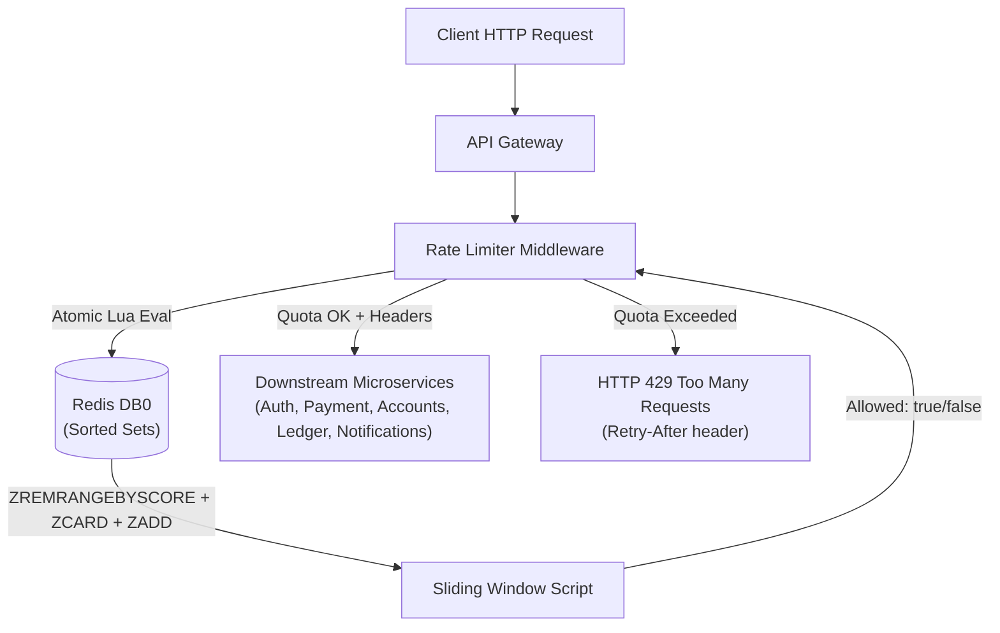

# Walkthrough: Prompt 13 — Distributed Rate Limiter (Redis + Lua)

Implemented distributed rate limiting for the **VaultCore API Gateway** using **Redis DB0**, **Lua scripts for atomic sliding window enforcement**, tier-based quotas, standard HTTP headers, fail-open resiliency, and Prometheus metrics.

---

## 1. Architecture & Redis Strategy

- **Exclusivity**: Rate limiting exclusively uses **Redis DB0** (`REDIS_DATABASES.RATE_LIMIT = 0`), preserving DB1 (Cache), DB2 (Distributed Locks), and DB3 (Refresh Tokens/Sessions).
- **Key Formats**:
  - Authenticated requests: `rate:user:{userId}`
  - Anonymous / Public requests: `rate:ip:{ipAddress}`



---

## 2. Sliding Window Algorithm (Atomic Lua Script)

Located in [`RateLimiterService`](file:///c:/Users/HARSHITHA/OneDrive/Desktop/VaultCore/shared/src/rate-limit/rateLimiterService.js):

1. **Purge Expired Timestamps**: Removes timestamps older than `nowMs - windowMs` using `ZREMRANGEBYSCORE`.
2. **Count Active Requests**: Reads active timestamps within the current sliding window using `ZCARD`.
3. **Atomic Admission**:
   - If count `<` limit: adds current timestamp (`nowMs`) with unique member to the Sorted Set via `ZADD`, sets TTL with `EXPIRE`, and returns `{1, remaining, resetSeconds, 0}`.
   - If count `>=` limit: queries the earliest timestamp via `ZRANGE 0 0 WITHSCORES`, computes `retryAfter` and `resetSeconds`, and returns `{0, 0, resetSeconds, retryAfter}` without writing.
4. **Fail-Open Strategy**: If Redis encounters transient connection errors, requests are allowed to proceed to maintain platform availability.

---

## 3. Tier Configuration & Gateway Route Integration

Defined in [`RATE_LIMIT_CONFIG`](file:///c:/Users/HARSHITHA/OneDrive/Desktop/VaultCore/shared/src/constants/index.js) and wired in [`app.js`](file:///c:/Users/HARSHITHA/OneDrive/Desktop/VaultCore/services/gateway/src/app.js):

| Tier        | Routes                                                              | Limit       | Window | Key Strategy                             |
| :---------- | :------------------------------------------------------------------ | :---------- | :----- | :--------------------------------------- |
| **AUTH**    | `/api/v1/auth/*`, `/auth/*`                                         | **10 req**  | 60s    | `rate:ip:{ipAddress}`                    |
| **PAYMENT** | `/api/v1/payments/*`, `/payments/*`, `/api/v1/outbox/*`             | **20 req**  | 60s    | `rate:user:{userId}` (or IP if unauthed) |
| **GENERAL** | `/api/v1/accounts/*`, `/api/v1/ledger/*`, `/api/v1/notifications/*` | **100 req** | 60s    | `rate:user:{userId}` (or IP if unauthed) |

---

## 4. HTTP Headers & Error Response

On every request, the gateway sets:

- `X-RateLimit-Limit`: Maximum requests permitted per window
- `X-RateLimit-Remaining`: Remaining quota in current sliding window
- `X-RateLimit-Reset`: Unix timestamp in seconds when quota resets

When exceeded, returns **HTTP 429 Too Many Requests**:

- `Retry-After`: Number of seconds before next attempt is permitted
- Body:
  ```json
  {
    "success": false,
    "error": {
      "message": "Too many requests. Please try again later.",
      "details": {
        "code": "RATE_LIMIT_EXCEEDED",
        "tier": "AUTH",
        "limit": 10,
        "retryAfter": 60,
        "resetTime": 1789478550,
        "traceId": "trace-uuid"
      }
    },
    "timestamp": "2026-09-15T18:51:30.000Z"
  }
  ```

---

## 5. Observability & Metrics

- **Prometheus Metrics** ([metrics.js](file:///c:/Users/HARSHITHA/OneDrive/Desktop/VaultCore/services/gateway/src/middleware/metrics.js)):
  - `vaultcore_rate_limit_allowed_total{tier="AUTH|PAYMENT|GENERAL"}`
  - `vaultcore_rate_limit_blocked_total{tier="AUTH|PAYMENT|GENERAL"}`
- **Structured Logs**: Every check logs `traceId`, `userId`, `ip`, `endpoint`, `method`, `tier`, `key`, `limit`, `quotaRemaining`, and `latencyMs`.

---

## 6. Verification Results

Ran automated test suite `scratch/test-rate-limiter.js`:

```text
========================================================================
 VaultCore Prompt 13: Distributed Rate Limiter Test Suite
========================================================================

[1. Testing Redis Database Allocation & Rate Limit Tiers]
  ✔ Redis DB0 allocated exclusively; Tier quotas configured (Auth: 10/min, Payment: 20/min, General: 100/min)

[2. Testing Atomic Sliding Window Lua Evaluation]
[2026-09-15 18:51:28] [account-cache] info: Connected to Redis at localhost:6379 (DB 1)
[2026-09-15 18:51:28] [distributed-lock] info: Connected to Redis at localhost:6379 (DB 2)
[2026-09-15 18:51:28] [rate-limiter] info: RateLimiterService connected to Redis DB0 at localhost:6379
[2026-09-15 18:51:28] [test-rate-limiter] info: RateLimiterService connected to Redis DB0 at localhost:6379
  ✔ Sliding window permits up to limit, computes remaining quota, and blocks excess with retryAfter

[3. Testing Gateway HTTP Rate Limiting & Response Headers]
  3.1 Testing Auth API rate limiting (10 req/min)...
[2026-09-15 18:51:30] [rate-limiter-middleware] [trace:9ca80fc4-244f-4110-b8ef-e40e3a875a6c] warn: Rate limit exceeded for [rate:ip:::1] on endpoint [POST /api/v1/auth/signup] {"userId":"anonymous","ip":"::1","endpoint":"/api/v1/auth/signup","method":"POST","tier":"AUTH","key":"rate:ip:::1","limit":10,"quotaRemaining":0,"latencyMs":1,"retryAfter":60}
[2026-09-15 18:51:30] [api-gateway] [trace:9ca80fc4-244f-4110-b8ef-e40e3a875a6c] info: POST /api/v1/auth/signup 429 1.53ms {"method":"POST","path":"/api/v1/auth/signup","statusCode":429,"responseTimeMs":1.53,"latency":"1.53ms","downstreamService":"gateway-internal","ip":"::1"}
    ✔ Request #11 correctly blocked with HTTP 429 Too Many Requests (Retry-After: 60s)
    ✔ Rate limit headers verified on Auth route: { limit: '10', remaining: '0', reset: '1789478550', retryAfter: '60' }

  3.2 Testing Payment API rate limiting (20 req/min per user)...
[2026-09-15 18:51:30] [rate-limiter-middleware] [trace:42d60cb3-159c-4747-9de3-3325f2d27331] info: Rate limit quota checked: 19/20 remaining for [rate:user:usr-pay-tester-1789478490045] {"userId":"usr-pay-tester-1789478490045","ip":"::1","endpoint":"/api/v1/payments/history","method":"GET","tier":"PAYMENT","key":"rate:user:usr-pay-tester-1789478490045","limit":20,"quotaRemaining":19,"latencyMs":2}
    ✔ Payment route returned X-RateLimit-Limit: 20

  3.3 Testing General API rate limiting (100 req/min per user)...
[2026-09-15 18:51:30] [rate-limiter-middleware] [trace:02f6c13b-26ff-4072-9a80-92c40f8595fd] info: Rate limit quota checked: 98/100 remaining for [rate:user:usr-pay-tester-1789478490045] {"userId":"usr-pay-tester-1789478490045","ip":"::1","endpoint":"/api/v1/accounts/100010001001","method":"GET","tier":"GENERAL","key":"rate:user:usr-pay-tester-1789478490045","limit":100,"quotaRemaining":98,"latencyMs":1}
    ✔ General route returned X-RateLimit-Limit: 100

[4. Testing Prometheus Rate Limiter Metrics]
  ✔ Prometheus metrics tracked: vaultcore_rate_limit_allowed_total and vaultcore_rate_limit_blocked_total

========================================================================
 ✔ ALL PROMPT 13 DISTRIBUTED RATE LIMITER TESTS PASSED SUCCESSFULLY
========================================================================
```
