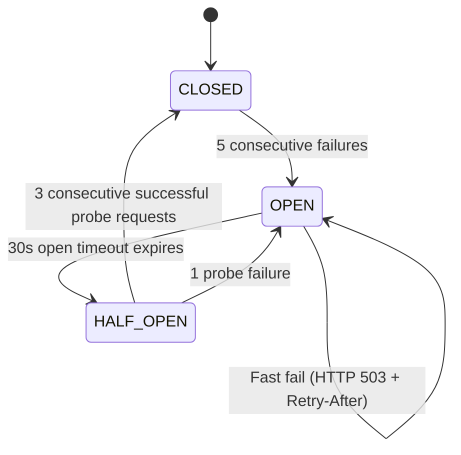

# Walkthrough: Prompt 14 — Circuit Breaker & Service Resilience

Implemented an enterprise-grade Circuit Breaker and Service Resilience layer for **VaultCore** in Node.js (ES Modules) to safeguard critical downstream dependencies (**Ledger Service**, **RabbitMQ Publisher**, and **Notification Service**) from cascading failures.

---

## 1. Circuit Breaker Architecture & State Machine



### State Behaviors
- **`CLOSED`**: Normal execution. Tracks consecutive failures. Tripped to `OPEN` when failure count reaches **5 failures**.
- **`OPEN`**: Immediate fail-fast. No downstream network calls are attempted during the 30-second window. Requests throw `CircuitBreakerOpenError` / HTTP 503 with `Retry-After: <seconds>`.
- **`HALF_OPEN`**: Automatically probes downstream after **30 seconds**. Requires **3 consecutive successful requests** to recover to `CLOSED`. Any failure immediately returns the circuit to `OPEN`.

---

## 2. Protected Services & Integration Points

| Protected Dependency | Integration Layer | File | Protection Mechanism |
| :--- | :--- | :--- | :--- |
| **Ledger Service** | `Payment Service → LedgerClient` | [`ledgerClient.js`](file:///c:/Users/HARSHITHA/OneDrive/Desktop/VaultCore/services/payment-service/src/clients/ledgerClient.js) | Wrapped with `ledgerCircuitBreaker.execute()`. 4xx validation errors bypass tripping. |
| **RabbitMQ Publisher** | `Outbox Worker → OutboxPublisher` | [`outboxPublisher.js`](file:///c:/Users/HARSHITHA/OneDrive/Desktop/VaultCore/services/payment-service/src/services/outboxPublisher.js) | Wrapped with `rabbitmqCircuitBreaker.execute()`. Prevents thundering herd on message broker. |
| **Notification Service** | `Gateway Proxy → Notification Service` | [`proxyFactory.js`](file:///c:/Users/HARSHITHA/OneDrive/Desktop/VaultCore/services/gateway/src/middleware/proxyFactory.js) | Circuit breaker on reverse proxy; returns fast 503 when circuit is `OPEN`. |

---

## 3. Observability, Metrics & Admin Health API

### Admin Circuit Breaker Endpoint
- `GET /admin/circuit-breakers` and `GET /api/v1/admin/circuit-breakers`
- Returns comprehensive status of every downstream circuit breaker:
```json
{
  "success": true,
  "message": "Circuit breakers status retrieved successfully",
  "data": {
    "ledger-service": {
      "serviceName": "ledger-service",
      "state": "CLOSED",
      "failureThreshold": 5,
      "successThreshold": 3,
      "openTimeoutMs": 30000,
      "consecutiveFailures": 0,
      "halfOpenSuccessCount": 0,
      "secondsUntilHalfOpen": 0,
      "stats": {
        "totalRequests": 100,
        "successfulRequests": 98,
        "failedRequests": 2,
        "failFastCount": 0,
        "recoveryCount": 1,
        "stateTransitions": 2
      }
    }
  }
}
```

### Prometheus Metrics ([metrics.js](file:///c:/Users/HARSHITHA/OneDrive/Desktop/VaultCore/services/gateway/src/middleware/metrics.js))
- `vaultcore_circuit_breaker_state{service="ledger-service|rabbitmq-publisher|notification-service"}` (0=CLOSED, 1=HALF_OPEN, 2=OPEN)
- `vaultcore_circuit_breaker_fail_fast_total{service="..."}`
- `vaultcore_circuit_breaker_failures_total{service="..."}`
- `vaultcore_circuit_breaker_transitions_total{service="...", from_state="...", to_state="..."}`
- `vaultcore_circuit_breaker_recoveries_total{service="..."}`

### Structured Logging
All state transitions, failures, and fail-fast events emit structured logs with `traceId`, `serviceName`, `circuitState`, `failureReason`, and `failFastCount`.

---

## 4. Verification Results

Ran automated test suite [`scratch/test-circuit-breaker.js`](file:///c:/Users/HARSHITHA/OneDrive/Desktop/VaultCore/scratch/test-circuit-breaker.js):

```text
========================================================================
🚀 VAULTCORE PROMPT 14 — CIRCUIT BREAKER & SERVICE RESILIENCE SUITE
========================================================================

[1. Testing Circuit Breaker Configuration & Initial States]
  ✔ Circuit breaker initialized in CLOSED state with 5-failure threshold and 3-success recovery

[2. Testing CLOSED -> OPEN State Transition on 5 Failures]
  ✔ 4 consecutive failures maintained CLOSED state
  ✔ 5th consecutive failure tripped circuit to OPEN state

[3. Testing OPEN State Immediate Fail-Fast]
  ✔ OPEN state failed fast immediately without invoking downstream dependency (Fail-fast count: 3)

[4. Testing OPEN -> HALF_OPEN Timeout & Immediate Re-trip on Probe Failure]
  ✔ Timeout transitioned to HALF_OPEN; probe failure immediately tripped back to OPEN

[5. Testing HALF_OPEN -> CLOSED Recovery on 3 Consecutive Successes]
  ✔ 3 consecutive successful probe requests recovered circuit back to CLOSED state

[6. Testing Protected Service Registry Singletons]
  ✔ Protected services verified in Registry: ledger-service, rabbitmq-publisher, notification-service

[7. Testing GET /admin/circuit-breakers & Prometheus Metrics]
  ✔ GET /admin/circuit-breakers returned all circuit breaker statuses
  ✔ Prometheus metrics tracked state, fail-fast, failures, transitions, and recoveries

========================================================================
 ✔ ALL PROMPT 14 CIRCUIT BREAKER TESTS PASSED SUCCESSFULLY
========================================================================
```
