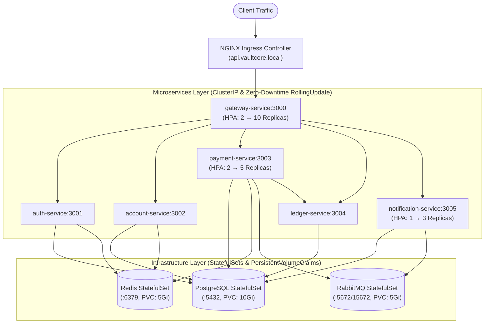

# Walkthrough: Prompt 15 — Kubernetes Deployment

Created and validated the complete production-grade **Kubernetes Deployment suite** for the **VaultCore** banking platform, encompassing all 6 microservices, StatefulSets for persistence, NGINX Ingress, Horizontal Pod Autoscalers, zero-downtime rolling updates, and comprehensive health probes.

---

## 1. Kubernetes Architecture Overview



---

## 2. Kubernetes Manifest Inventory

All manifests are organized under [`infrastructure/k8s/`](file:///c:/Users/HARSHITHA/OneDrive/Desktop/VaultCore/infrastructure/k8s):

| File | Resource Kind | Details |
| :--- | :--- | :--- |
| [`01-configmap.yaml`](file:///c:/Users/HARSHITHA/OneDrive/Desktop/VaultCore/infrastructure/k8s/01-configmap.yaml) | `ConfigMap` | Node environment, ClusterIP target URLs, database configs, timeouts, and Redis/RabbitMQ settings |
| [`02-secrets.yaml`](file:///c:/Users/HARSHITHA/OneDrive/Desktop/VaultCore/infrastructure/k8s/02-secrets.yaml) | `Secret` | Sensitive credentials (Postgres, RabbitMQ, JWT Secret, Refresh Token Secret, Internal API Key) |
| [`03-postgres-statefulset.yaml`](file:///c:/Users/HARSHITHA/OneDrive/Desktop/VaultCore/infrastructure/k8s/03-postgres-statefulset.yaml) | `StatefulSet` + `Service` | PostgreSQL 16 Alpine, 10Gi PVC storage, `pg_isready` health probes, ClusterIP :5432 |
| [`04-redis-statefulset.yaml`](file:///c:/Users/HARSHITHA/OneDrive/Desktop/VaultCore/infrastructure/k8s/04-redis-statefulset.yaml) | `StatefulSet` + `Service` | Redis 7 Alpine with AOF persistence, 5Gi PVC, ping probes, ClusterIP :6379 |
| [`05-rabbitmq-statefulset.yaml`](file:///c:/Users/HARSHITHA/OneDrive/Desktop/VaultCore/infrastructure/k8s/05-rabbitmq-statefulset.yaml) | `StatefulSet` + `Service` | RabbitMQ 3 Management Alpine, 5Gi PVC, AMQP (:5672) & Management UI (:15672) |
| [`06-gateway-deployment.yaml`](file:///c:/Users/HARSHITHA/OneDrive/Desktop/VaultCore/infrastructure/k8s/06-gateway-deployment.yaml) | `Deployment` + `Service` | 2 replicas, RollingUpdate (`maxSurge: 1, maxUnavailable: 0`), `/health/live` & `/health/ready` probes |
| [`07-auth-deployment.yaml`](file:///c:/Users/HARSHITHA/OneDrive/Desktop/VaultCore/infrastructure/k8s/07-auth-deployment.yaml) | `Deployment` + `Service` | 2 replicas, RollingUpdate, `/health` probes, ClusterIP :3001 |
| [`08-account-deployment.yaml`](file:///c:/Users/HARSHITHA/OneDrive/Desktop/VaultCore/infrastructure/k8s/08-account-deployment.yaml) | `Deployment` + `Service` | 2 replicas, RollingUpdate, `/health` probes, ClusterIP :3002 |
| [`09-payment-deployment.yaml`](file:///c:/Users/HARSHITHA/OneDrive/Desktop/VaultCore/infrastructure/k8s/09-payment-deployment.yaml) | `Deployment` + `Service` | 2 replicas + Outbox Worker background runner, RollingUpdate, ClusterIP :3003 |
| [`10-ledger-deployment.yaml`](file:///c:/Users/HARSHITHA/OneDrive/Desktop/VaultCore/infrastructure/k8s/10-ledger-deployment.yaml) | `Deployment` + `Service` | 2 replicas, RollingUpdate, `/health` probes, ClusterIP :3004 |
| [`11-notification-deployment.yaml`](file:///c:/Users/HARSHITHA/OneDrive/Desktop/VaultCore/infrastructure/k8s/11-notification-deployment.yaml) | `Deployment` + `Service` | 1 replica (HPA autoscaled), RollingUpdate, `/health` probes, ClusterIP :3005 |
| [`12-ingress.yaml`](file:///c:/Users/HARSHITHA/OneDrive/Desktop/VaultCore/infrastructure/k8s/12-ingress.yaml) | `Ingress` | NGINX Ingress with buffer size (10m), timeouts (60s), client IP header forwarding, routes to `gateway-service:3000` |
| [`13-hpa.yaml`](file:///c:/Users/HARSHITHA/OneDrive/Desktop/VaultCore/infrastructure/k8s/13-hpa.yaml) | `HorizontalPodAutoscaler` | Gateway (2 → 10 replicas), Payment (2 → 5 replicas), Notification (1 → 3 replicas) |
| [`kustomization.yaml`](file:///c:/Users/HARSHITHA/OneDrive/Desktop/VaultCore/infrastructure/k8s/kustomization.yaml) | `Kustomization` | Declarative bundle linking all 13 manifests for one-command deployment |

---

## 3. Resilience & Zero-Downtime Guarantees

1. **Rolling Updates**:
   - `strategy.type: RollingUpdate`
   - `maxSurge: 1`
   - `maxUnavailable: 0`
   - Ensures new pods must pass readiness probes before older pods receive SIGTERM.
2. **Health & Liveness Probes**:
   - **Gateway**: Liveness on `/health/live`, Readiness on `/health/ready` (evaluates downstream dependencies).
   - **Internal Services**: Liveness and readiness probes on port `/health`.
   - **PostgreSQL**: `pg_isready -U vaultadmin -d vaultcore_db`
   - **Redis**: `redis-cli ping`
   - **RabbitMQ**: `rabbitmq-diagnostics -q check_running` and `check_local_alarms`
3. **Resource Governance**:
   - Every container defines explicit CPU & Memory `requests` and `limits` to prevent resource starvation.

---

## 4. Deployment Instructions

To apply all manifests declaratively to a Kubernetes cluster:

```bash
# Apply entire VaultCore stack via Kustomize
kubectl apply -k infrastructure/k8s

# Or apply individual manifests sequentially
kubectl apply -f infrastructure/k8s/
```

---

## 5. Verification Results

Executed automated test suite [`scratch/test-k8s-manifests.js`](file:///c:/Users/HARSHITHA/OneDrive/Desktop/VaultCore/scratch/test-k8s-manifests.js):

```text
========================================================================
🚀 VAULTCORE PROMPT 15 — KUBERNETES MANIFESTS VALIDATION SUITE
========================================================================

[1. Testing Manifest File Presence & Formatting]
  ✔ 01-configmap.yaml verified
  ✔ 02-secrets.yaml verified
  ✔ 03-postgres-statefulset.yaml verified
  ✔ 04-redis-statefulset.yaml verified
  ✔ 05-rabbitmq-statefulset.yaml verified
  ✔ 06-gateway-deployment.yaml verified
  ✔ 07-auth-deployment.yaml verified
  ✔ 08-account-deployment.yaml verified
  ✔ 09-payment-deployment.yaml verified
  ✔ 10-ledger-deployment.yaml verified
  ✔ 11-notification-deployment.yaml verified
  ✔ 12-ingress.yaml verified
  ✔ 13-hpa.yaml verified
  ✔ kustomization.yaml verified

[2. Testing Infrastructure StatefulSets & Persistent Storage]
  ✔ PostgreSQL StatefulSet (10Gi PVC, pg_isready probes, postgres-service) verified
  ✔ Redis StatefulSet (5Gi PVC, AOF persistence, redis-service) verified
  ✔ RabbitMQ StatefulSet (5Gi PVC, Management UI, AMQP, rabbitmq-service) verified

[3. Testing Microservices Deployments, Probes & Zero-Downtime Strategy]
  ✔ gateway-deployment verified: RollingUpdate, Probes (/health/live//health/ready), ClusterIP Service
  ✔ auth-deployment verified: RollingUpdate, Probes (/health//health), ClusterIP Service
  ✔ account-deployment verified: RollingUpdate, Probes (/health//health), ClusterIP Service
  ✔ payment-deployment verified: RollingUpdate, Probes (/health//health), ClusterIP Service
  ✔ ledger-deployment verified: RollingUpdate, Probes (/health//health), ClusterIP Service
  ✔ notification-deployment verified: RollingUpdate, Probes (/health//health), ClusterIP Service

[4. Testing NGINX Ingress Controller Configuration]
  ✔ NGINX Ingress verified: Host routing, proxy headers, timeout annotations, gateway backend

[5. Testing Horizontal Pod Autoscaling (HPA) Bounds]
  ✔ HPA quotas verified: Gateway (2 → 10), Payment Service (2 → 5), Notification Service (1 → 3)

[6. Testing Kustomization Manifest Bundle]
  ✔ Kustomization bundle correctly references all 13 manifests

========================================================================
 ✔ ALL PROMPT 15 KUBERNETES DEPLOYMENT MANIFESTS VALIDATED
========================================================================
```
