# VaultCore P17.1 — GitHub Actions CI Workflow Foundation

## Overview

Implemented the enterprise-grade Continuous Integration (CI) foundation for VaultCore in [`.github/workflows/ci.yml`](file:///c:/Users/HARSHITHA/OneDrive/Desktop/VaultCore/.github/workflows/ci.yml) and verified it using [`scratch/test-ci-workflow.js`](file:///c:/Users/HARSHITHA/OneDrive/Desktop/VaultCore/scratch/test-ci-workflow.js).

---

## Created Files

1. **[`.github/workflows/ci.yml`](file:///c:/Users/HARSHITHA/OneDrive/Desktop/VaultCore/.github/workflows/ci.yml)**: Complete GitHub Actions CI Pipeline definition with job matrix, caching, service containers, artifact uploads, and markdown summary.
2. **[`scratch/test-ci-workflow.js`](file:///c:/Users/HARSHITHA/OneDrive/Desktop/VaultCore/scratch/test-ci-workflow.js)**: Automated verification test script checking syntax, triggers, steps, matrices, caching, and reporting.

---

## CI Pipeline Architecture & Flow

```mermaid
flowchart TD
    Trigger([Push to branches / PRs]) --> Job1[1. Code Quality, Schema & Security]

    subgraph Job1_Steps [Quality Gate]
        J1_1[Checkout] --> J1_2[Setup Node.js 22 + npm cache]
        J1_2 --> J1_3[npm ci]
        J1_3 --> J1_4[prisma validate & generate]
        J1_4 --> J1_5[Prettier Check]
        J1_5 --> J1_6[ESLint Workspaces]
        J1_6 --> J1_7[npm audit --omit=dev]
    end

    Job1 --> Job2[2. Backend Unit Tests Matrix]
    Job1 --> Job3[3. Frontend Tests & Build]

    subgraph Job2_Matrix [Service Matrix: gateway, auth, account, payment, ledger, notification]
        J2_1[Setup Node 22] --> J2_2[Generate Prisma]
        J2_2 --> J2_3[Run Service Unit Tests]
        J2_3 --> J2_4[Upload Coverage Artifacts]
    end

    subgraph Job3_Steps [Frontend Gate]
        J3_1[Setup Node 22] --> J3_2[npm ci]
        J3_2 --> J3_3[npm run build]
        J3_3 --> J3_4[Upload Frontend Artifact]
    end

    Job2 --> Job4[4. Platform Integration Tests]
    Job3 --> Job4

    subgraph Job4_Services [Container Services: PostgreSQL, Redis, RabbitMQ]
        J4_1[PostgreSQL :5433]
        J4_2[Redis :6379]
        J4_3[RabbitMQ :5672]
    end

    subgraph Job4_Steps [Integration Suites]
        J4_S1[Prisma db push] --> J4_S2[Gateway, Circuit Breaker, Rate Limiter, Outbox Suites]
        J4_S2 --> J4_S3[Upload Integration Coverage]
    end

    Job4 --> Job5[5. CI Workflow Summary]
    subgraph Job5_Steps [Final Report]
        J5_1[Download Coverage Artifacts] --> J5_2[Publish $GITHUB_STEP_SUMMARY]
    end
```



---

## Key Pipeline Specifications

| Section                 | Specification                | Details                                                                                                                                                          |
| :---------------------- | :--------------------------- | :--------------------------------------------------------------------------------------------------------------------------------------------------------------- |
| **Triggers**            | `push` & `pull_request`      | Triggers on all branches; ignores release tags (`v*`)                                                                                                            |
| **Runtime**             | Node.js `22`                 | Configured with `actions/setup-node@v4` and `cache: 'npm'`                                                                                                       |
| **Dependencies**        | Deterministic Install        | Runs `npm ci` for workspace dependencies                                                                                                                         |
| **Schema Validation**   | Prisma Schema                | Validates with `prisma validate` and generates client with `prisma generate`                                                                                     |
| **Lint & Formatting**   | ESLint & Prettier            | Executes `eslint` across `services/*`, `shared`, `frontend` and `prettier --check`                                                                               |
| **Backend Unit Tests**  | Matrix Strategy              | Parallel matrix test execution across all 6 services (`gateway`, `auth-service`, `account-service`, `payment-service`, `ledger-service`, `notification-service`) |
| **Frontend Validation** | Vite Production Build        | Verifies frontend bundle integrity and asset compilation                                                                                                         |
| **Integration Tests**   | Multi-Container Testing      | Runs integration test suites against live PostgreSQL, Redis, and RabbitMQ container services                                                                     |
| **Coverage Artifacts**  | `actions/upload-artifact@v4` | Retains unit, frontend, and integration coverage artifacts for 14 days                                                                                           |
| **Security Audit**      | `npm audit --omit=dev`       | Scans production dependencies for vulnerabilities                                                                                                                |
| **Summary Report**      | `$GITHUB_STEP_SUMMARY`       | Publishes structured Markdown summary tables directly to GitHub Actions run page                                                                                 |

---

## Verification Results

Executing [`scratch/test-ci-workflow.js`](file:///c:/Users/HARSHITHA/OneDrive/Desktop/VaultCore/scratch/test-ci-workflow.js):

```
=== VaultCore CI Workflow Foundation Verification ===

✅ PASS - ci.yml exists
✅ PASS - YAML syntax valid (Indentation and structure valid)
✅ PASS - Triggers: Pull Requests & Push (excluding tags) (PRs and push to branches, tags-ignore)
✅ PASS - Node 22 setup exists (actions/setup-node@v4 with node-version: 22)
✅ PASS - npm cache exists (cache: "npm" enabled)
✅ PASS - Prisma validation & generate step exists (npx prisma validate & generate)
✅ PASS - ESLint step exists (ESLint check across workspaces)
✅ PASS - Prettier formatting step exists (Prettier check step)
✅ PASS - Unit tests exist (6 services matrix) (gateway, auth, account, payment, ledger, notification)
✅ PASS - Frontend tests & build exist (frontend-tests job)
✅ PASS - Integration tests exist (integration-tests job with postgres, redis, rabbitmq)
✅ PASS - Coverage upload exists (actions/upload-artifact@v4 for coverage reports)
✅ PASS - npm audit exists (npm audit --omit=dev)
✅ PASS - Workflow summary exists ($GITHUB_STEP_SUMMARY markdown reporting)

======================================================
🎉 All 14/14 CI foundation verification checks PASSED!
```
